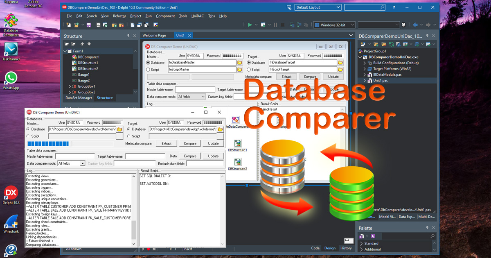

# Database Comparer in Delphi (UniDAC)

This Delphi project connects to an IB database via the UniDAC library, compares, synchronizes, and updates the database structure and table data.   

The project represents a mostly simple demos and by no means, a complete application. It's intended to demonstrate how to use the [DB Comparer](https://www.clevercomponents.com/products/dbcvcl/dbcomparer.asp) component in your Delphi application. Additionally, the program uses the [Table Data Comparer](https://www.clevercomponents.com/products/dbcvcl/tabledatacomparer.asp) component to synchronize table records between two different databases.   
   
   
   
The connection to an Interbase / Firebird database is made using the [UniDAC](https://www.devart.com/unidac/) library.

How to compile:   
1. Please clone the [CleverComponents/Database-Comparer-Examples](https://github.com/CleverComponents/Database-Comparer-Examples) repository.
2. Download and install the [Database Comparer VCL](https://www.clevercomponents.com/downloads/dbc/dbcvcldownload.asp) library.
3. Open and compile the DBComparerDemoUniDac project in your Delphi IDE.
4. Enjoy.

Please feel free to [Contact Us](https://www.clevercomponents.com/support/) and ask any program related questions.   

Keep updated on [Facebook](http://www.facebook.com/clevercomponents)   [YouTube](https://www.youtube.com/channel/UC9Si4WNQVSeXQMjdEJ8j1fg)   [Twitter](https://twitter.com/CleverComponent)   [Telegram](https://t.me/clevercomponents)   [Newsletter](https://www.clevercomponents.com/home/maillist.asp)   
