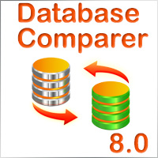

# Database Comparer Examples

These example projects are simple demos, and by no means complete applications.

They are intended to demonstrate the usage of the [Database Comparer VCL](https://www.clevercomponents.com/products/dbcvcl/) components in your code.

## Database Comparer VCL Demos for Delphi

| Program Name | Description |
|---|---|
|[Database Comparer (FireDAC)](./Delphi/DBComparerDemoFireDAC)|Compares, synchronizes and updates databases structure and table data. Connects to a Firebird database via FireDAC. Available starting from RAD Studio XE8.|
|[Database Comparer (IB Express)](./Delphi/DBComparerDemoIBX)|Compares, synchronizes and updates databases structure. Connects to an IB database via IBExpress.|
|[Database Comparer (UniDAC)](./Delphi/DBComparerDemoUniDAC)|Compares, synchronizes and updates databases structure. Connects to a Firebird / Interbase database via UniDAC.|
|[Database Comparer (FIBPlus)](./Delphi/DBComparerDemoFIB)|Compares, synchronizes and updates databases structure. Connects to an IB database via FIBPlus. This demo is not available starting from RAD Studio 10 Seattle.|
|[Database Comparer (ADO)](./Delphi/DBComparerDemoADO)|Compares, synchronizes and updates databases structure. Connects to a MS SQL database via ADO.|
|[Table Data Comparer](./Delphi/TableDataComparer)|Compares and synchronizes data between two database tables. This demo is not available starting from RAD Studio XE7. See also [DB Comparer (FireDAC)](./Delphi/DBComparerDemoFireDAC) and [DB Comparer (IB Express)](./Delphi/DBComparerDemoIBX) demos.|
|[Table Data Comparer (Custom SQL)](./Delphi/DataComparerCustomSQL)|An example for TTableDataComparer, which shows how to compare and synchronize two Firebird DB tables using a user-defined SQL script to fetch records. The connection is implemented via the FireDAC library. Available starting from RAD Studio XE8.|
|[SQL Script Comparer](./Delphi/ScriptComparer)|Compares two database scripts and displays the resulting update script.|
|[Extract Metadata](./Delphi/ExtractMetadata)|Extracts the database metadata and displays the script.|
|[Execute Local SQL Script](./Delphi/LocalSQLScript)|Loads and executes a LocalSQL (BDE) script for local databases (Paradox, dBASE). This demo is not available starting from RAD Studio XE7.|

## Database Comparer VCL Demos for C++Builder

| Program Name | Description |
|---|---|
|[Database Comparer (FireDAC)](./CBuilder/DBComparerDemoFireDAC)|Compares, synchronizes and updates databases structure and table data. Connects to a Firebird database via FireDAC. Available starting from RAD Studio XE8.|
|[Database Comparer (IB Express)](./CBuilder/DBComparerDemoIBX)|Compares, synchronizes and updates databases structure. Connects to an IB database via IBExpress.|
|[Database Comparer (UniDAC)](./CBuilder/DBComparerDemoUniDAC)|Compares, synchronizes and updates databases structure. Connects to a Firebird / Interbase database via UniDAC.|
|[Database Comparer (FIBPlus)](./CBuilder/DBComparerDemoFIB)|Compares, synchronizes and updates databases structure. Connects to an IB database via FIBPlus. This demo is not available starting from RAD Studio 10 Seattle.|
|[Database Comparer (ADO)](./CBuilder/DBComparerDemoADO)|Compares, synchronizes and updates databases structure. Connects to a MS SQL database via ADO.|
|[Table Data Comparer](./CBuilder/TableDataComparer)|Compares and synchronizes data between two database tables. This demo is not available starting from RAD Studio XE7. See also [DB Comparer (FireDAC)](./Delphi/DBComparerDemoFireDAC) and [DB Comparer (IB Express)](./Delphi/DBComparerDemoIBX) demos.|
|[Table Data Comparer (Custom SQL)](./CBuilder/DataComparerCustomSQL)|An example for TTableDataComparer, which shows how to compare and synchronize two Firebird DB tables using a user-defined SQL script to fetch records. The connection is implemented via the FireDAC library. Available starting from RAD Studio XE8.|
|[SQL Script Comparer](./CBuilder/ScriptComparer)|Compares two database scripts and displays the resulting update script.|
|[Extract Metadata](./CBuilder/ExtractMetadata)|Extracts the database metadata and displays the script.|
|[Execute Local SQL Script](./CBuilder/LocalSQLScript)|Loads and executes a LocalSQL (BDE) script for local databases (Paradox, dBASE). This demo is not available starting from RAD Studio XE7.|
